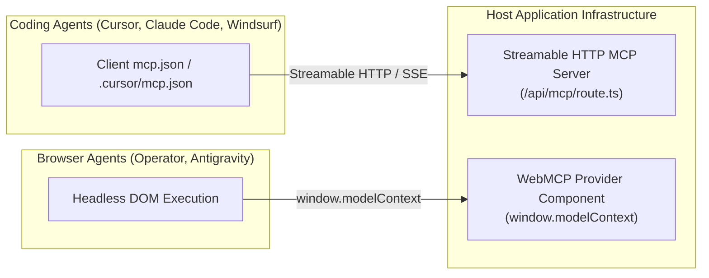

# MCP & WebMCP Tooling Remediation Protocol (ARS 2.0 Layer 3)

## 1. Executive Context & The "Agent Blindness" Problem

Autonomous AI coding agents (Claude Code, Cursor, Windsurf, Devin) and browser agents (OpenAI Operator, Antigravity) fail when interacting with modern applications because platforms are engineered exclusively for human eyes and manual clicks.

* **The Problem**: Agents attempting to integrate with an API or web app must guess parameter names, reverse-engineer unversioned endpoints, or hallucinate UI interactions from headless DOM snapshots.
* **The Solution**: Glintbase Layer 3 establishes **two complementary tool-calling surfaces**:
  1. **Streamable HTTP MCP Server (`/api/mcp`)**: Server-side JSON-RPC / Server-Sent Events (SSE) route exposing live backend operations directly into developer IDEs and coding agents.
  2. **Browser-Native WebMCP (`window.modelContext`)**: Client-side DOM bridge exposing structured UI state, action descriptors, and interactive tools directly to browser agents.

---

## 2. Canonical Architecture & Protocol Specifications



### 2.1 Artifact 1: Client Configuration (`mcp.json` / `.cursor/mcp.json`)
Placed at repository root or inside `.cursor/mcp.json`, `.vscode/mcp.json`:
```json
{
  "mcpServers": {
    "target-platform": {
      "url": "https://api.example.com/api/mcp",
      "transport": "sse"
    }
  }
}
```

### 2.2 Artifact 2: Streamable HTTP MCP Server Route (`/api/mcp`)
* **Transport**: HTTP POST (JSON-RPC 2.0) and optional GET with Server-Sent Events (`Accept: text/event-stream`).
* **Headers**: `Content-Type: application/json` or `text/event-stream`, `X-MCP-Version: 2024-11-05`.
* **Standard Methods Supported**:
  * `tools/list`: Returns array of available tools with typed JSON Schema definitions.
  * `tools/call`: Executes a tool with verified parameters and returns structured `content`.

### 2.3 Artifact 3: Browser-Native WebMCP Provider (`components/WebMcpProvider.tsx`)
* Implements the **WebMCP Standard v0.9.1**:
```typescript
interface WindowModelContext {
  version: '0.9.1';
  agentReady: boolean;
  platform: string;
  tools: Array<{
    name: string;
    description: string;
    parameters?: Record<string, any>;
    execute?: (params: any) => Promise<any> | any;
  }>;
  state?: Record<string, any>;
}
```

---

## 3. Step-by-Step Remediation Workflow (The Golden Path)

### Phase 1: Codebase AST Discovery
1. Inspect `package.json` to identify framework (`next`, `astro`, `remix`, `fastapi`, `express`).
2. Scan route definitions (`app/api/`, `pages/api/`, `routes/`) to discover live endpoints.
3. Extract HTTP verbs (`GET`, `POST`), path parameters, and query parameters.

### Phase 2: Streamable MCP Server Implementation
1. Generate `app/api/mcp/route.ts` (or Express/FastAPI equivalent).
2. Register discovered routes as callable tools with strict parameter schemas.
3. Add input validation using Zod or standard JSON schema.

### Phase 3: WebMCP Browser Instrumentation
1. Create a dedicated standalone component: `components/WebMcpProvider.tsx`.
2. Instrument `window.modelContext` within a client-side `useEffect` hook.
3. Safely insert `<WebMcpProvider />` into `app/layout.tsx` (creating a `.bak` backup first).

### Phase 4: Sandbox Self-Verification
1. Verify `mcp.json` contains valid JSON with non-empty `mcpServers`.
2. Verify `/api/mcp` exports `GET` and `POST` handlers.
3. Verify `components/WebMcpProvider.tsx` defines `window.modelContext`.

---

## 4. Production Code Templates

### 4.1 Next.js App Router: `app/api/mcp/route.ts`
```typescript
import { NextRequest, NextResponse } from 'next/server';

export const runtime = 'nodejs';
export const dynamic = 'force-dynamic';

const AVAILABLE_TOOLS = [
  {
    name: 'query_resource',
    description: 'Fetch resource details by ID or slug',
    inputSchema: {
      type: 'object',
      properties: {
        id: { type: 'string', description: 'Unique resource identifier' },
      },
      required: ['id'],
    },
  },
  {
    name: 'get_system_status',
    description: 'Retrieve live API health and rate limit status',
    inputSchema: {
      type: 'object',
      properties: {},
    },
  },
];

export async function GET(req: NextRequest) {
  return new NextResponse('MCP Streamable Server Endpoint Active', {
    status: 200,
    headers: {
      'Content-Type': 'text/plain',
      'X-MCP-Version': '2024-11-05',
    },
  });
}

export async function POST(req: NextRequest) {
  try {
    const body = await req.json();
    const { id, method, params } = body;

    // 1. Tool discovery
    if (method === 'tools/list') {
      return NextResponse.json({
        jsonrpc: '2.0',
        id,
        result: { tools: AVAILABLE_TOOLS },
      });
    }

    // 2. Tool execution
    if (method === 'tools/call') {
      const toolName = params?.name;
      const toolArgs = params?.arguments || {};

      if (toolName === 'get_system_status') {
        return NextResponse.json({
          jsonrpc: '2.0',
          id,
          result: {
            content: [
              {
                type: 'text',
                text: JSON.stringify({ status: 'operational', timestamp: Date.now() }),
              },
            ],
          },
        });
      }

      return NextResponse.json(
        {
          jsonrpc: '2.0',
          id,
          error: { code: -32601, message: `Tool '${toolName}' not found` },
        },
        { status: 404 }
      );
    }

    return NextResponse.json(
      {
        jsonrpc: '2.0',
        id,
        error: { code: -32600, message: 'Invalid Request' },
      },
      { status: 400 }
    );
  } catch (err: any) {
    return NextResponse.json({ error: err.message }, { status: 500 });
  }
}
```

### 4.2 WebMCP Provider Component: `components/WebMcpProvider.tsx`
```typescript
'use client';

import { useEffect } from 'react';

export function WebMcpProvider() {
  useEffect(() => {
    if (typeof window === 'undefined') return;

    (window as any).modelContext = {
      version: '0.9.1',
      agentReady: true,
      platform: 'Host Platform',
      tools: [
        {
          name: 'get_page_context',
          description: 'Returns active view state, navigation tree, and selected entity metadata',
          execute: () => ({
            pathname: window.location.pathname,
            title: document.title,
            timestamp: Date.now(),
          }),
        },
      ],
    };

    window.dispatchEvent(new CustomEvent('modelContextReady'));
  }, []);

  return null;
}
```

---

## 5. Anti-Patterns & Failure Modes

| Anti-Pattern | Agent Consequence | Glintbase ARS Penalty |
| :--- | :--- | :--- |
| **Missing `mcp.json`** | Cursor and Windsurf cannot discover or bind the local server | -10 pts in Usability |
| **Empty `tools/list`** | Agent establishes connection but sees zero capabilities | Capped at 5/15 pts |
| **Direct Script Injection in Layout** | Modifying layout without provider component risks breaking JSX syntax or hydration | Build failure risk |
| **Missing Parameter Types** | Agent hallucinates argument names and types, failing calls | Rejected by Sandbox |

---

## 6. Verification Checklist

Run targeted verification to confirm remediation:
```bash
# Verify live MCP endpoint
glintbase check http://localhost:3000 mcp

# Full Layer 3 audit
glintbase audit http://localhost:3000
```
Expected impact: **+25 to +35 points** in Layer 3 Usability.

---

## 7. Research Sources & Normative Citations

1. **Anthropic Model Context Protocol (MCP)**:
   * Specification: [modelcontextprotocol.io](https://modelcontextprotocol.io)
   * Schema & Protocol Reference: [github.com/modelcontextprotocol/specification](https://github.com/modelcontextprotocol/specification)
   * Tool Design Guide: [modelcontextprotocol.io/docs/concepts/tools](https://modelcontextprotocol.io/docs/concepts/tools)
2. **IDE Client Integrations**:
   * Cursor MCP Guide: [docs.cursor.com/context/model-context-protocol](https://docs.cursor.com/context/model-context-protocol)
   * Claude Desktop MCP Configuration: [modelcontextprotocol.io/quickstart/user](https://modelcontextprotocol.io/quickstart/user)
   * Windsurf Cascade Protocol: [codeium.com/windsurf/docs](https://codeium.com/windsurf/docs)
3. **WebMCP Browser Standard**:
   * Architecture & Design: [references/webmcp-spec.md](file:///c:/Users/USER/Desktop/glintbase/glintbase-cli/src/harness/skills/mcp-webmcp/references/webmcp-spec.md)
   * DOM Interaction Taxonomy: Glintbase Web Agent Research Group (2025/2026)
4. **Glintbase Scanner Specifications**:
   * Tool Harness & Journey Pathfinder: [`glintscanner/docs/specs/05-pathfinder.md`](file:///c:/Users/USER/Desktop/glintbase/glintscanner/docs/specs/05-pathfinder.md)
   * ARS Methodology & Dimension Weights: [`glintscanner/docs/methodology/ars-1.0.md`](file:///c:/Users/USER/Desktop/glintbase/glintscanner/docs/methodology/ars-1.0.md)

